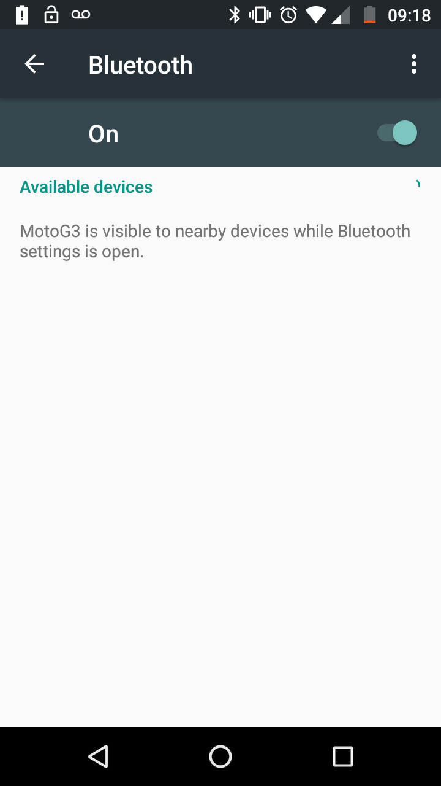
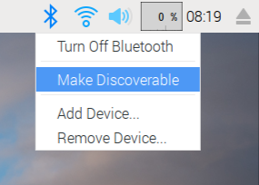
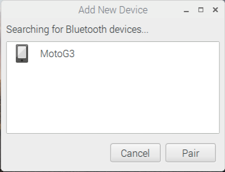
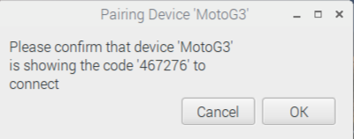
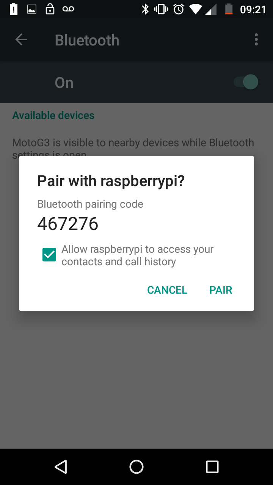
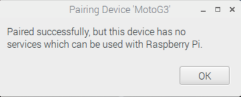
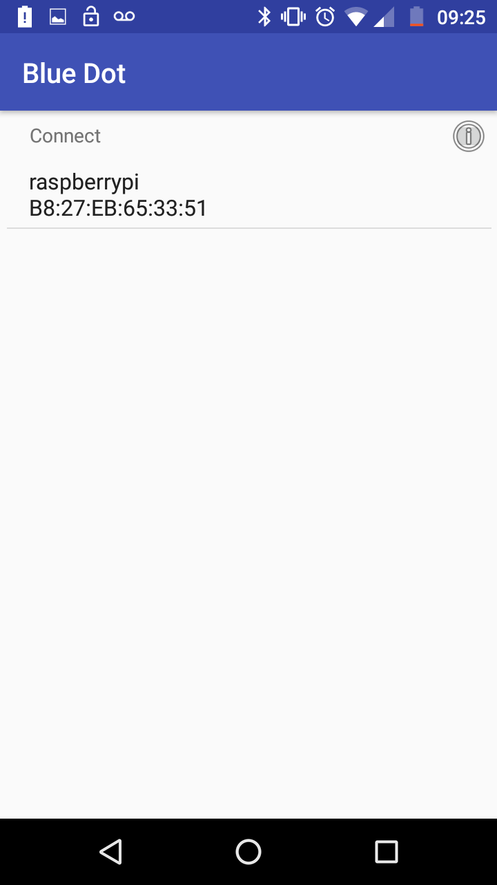
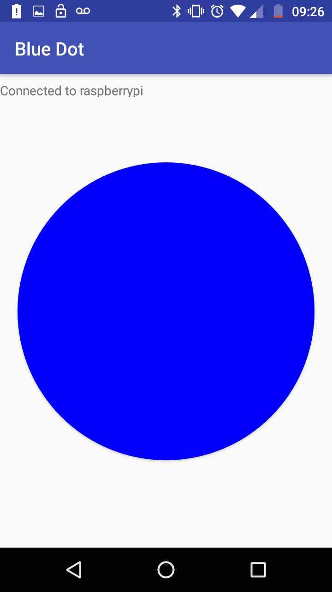
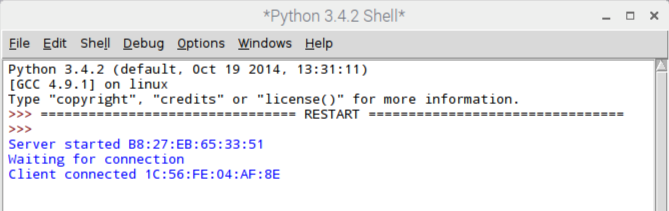

To begin using BlueDot, you will need to pair your Android device with your Raspberry Pi

On your Android device:
- Open `Settings`
- Select `Bluetooth`, to make your device discoverable
  

On your Raspberry Pi:
- Click on the  Bluetooth icon in the task bar.
- Turn on Bluetooth
- Click on `Make Discoverable`
  
- Click `Add Device`
- Your Android device should appear in the list. Select it and click `Pair`
  
  
You will then be prompted to accept or input a pin number. Once this has been completed, your devices should be paired.





### Receiving signals with Python

You can now use the BlueDot Python module to receive messages from the Android App.

- On your Raspberry Pi, you can use Python3 IDLE or another IDE to write the following simple program.

	```python
	from bluedot import BlueDot
	bd = BlueDot()
	bd.wait_for_press()
	print("You pressed the blue dot!")
	```

- Save and run the code.
- On your Android device, open the BlueDot app and select your Raspberry Pi from the list of available devices.
	
	
- You should see a message in the Python shell, telling you that the device has connected.
  
- Push the blue dot on the android screen, and the message `You pressed the blue dot!` will appear in the shell.

### More methods

- The following additional methods can be used, to receive more information about how the user is interacting with the blue dot.

	```python
	bd.when_pressed = foo ##run the function foo when the blue dot is pressed
	bd.when_release = bar ##run the function bar when the blue dot is released
	bd.when_moved = baz ##run the function baz when your finger moves on the blue dot
	```

- When the functions are called, the position of the user's finger on the blue dot will be passed into the function. An example `foo` function might look like this:

	```python
	def foo(pos):
		print(pos.x)
		print(pos.y)
	```

- This will provide you with the `x` and `y` coordinates of the finger on the blue dot (from -1 to 1).

- Additionally, `pos.top` would return `True` if the finger press was near the top of the blue dot. Similarly, `pos.bottom`, `pos.right` and `pos.left` can be used.
